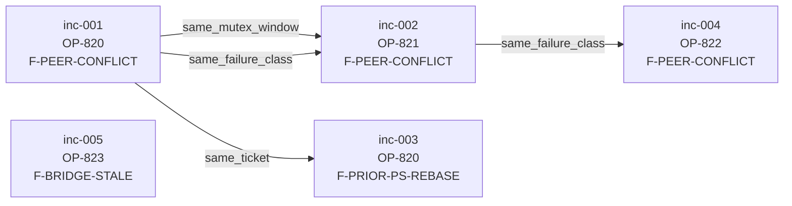

# Failure-Graph Runbook (C8)

> **Spec source**: `docs/audit/2026-05-11-sprint-abc-master-plan.md` §3.9
> **Code**: `backend/agents/failure_graph.py`, `scripts/dump_failure_graph.py`, `scripts/rebuild_failure_graph.py`
> **Pickup wiring**: `auto-runner-jira.py` (`_build_prompt`)
> **Status**: ships with C2 (`runner_incidents` table) and C3 (Cognee KG) marked as upstream deps; the graph operates in a degraded "JSON-fixture" mode until those land. Degrade behaviour is the AC-mandated `FailureGraphCogneeUnavailable` path.

---

## What this is

The Failure-Graph is a directed graph of runner failure incidents that lets us answer two questions:

1. **At pickup time** — "has this ticket failed before, and what did the prior failures look like?" The runner injects a small system-message block describing the prior incidents and their graph neighbors so the agent doesn't re-walk the same wedge.
2. **At incident review** — "what does the last 7 days of failures look like fleet-wide?" The Mermaid dump is the artifact the incident-review meeting uses to spot causality clusters.

The data is *derived* — the authoritative store is the C2 `runner_incidents` Postgres table. If the graph is corrupted or Cognee drifts, a full rebuild always restores it from C2.

---

## Causality model

Three edge kinds, all directed from the earlier incident to the later one:

| Edge kind | Meaning | Inference |
|---|---|---|
| `same_mutex_window` | "the same file lock chained two tickets" | identical `mutex_label`, ≤1h apart |
| `same_ticket` | "this ticket failed N times in a row" | identical `ticket_key`, consecutive by time |
| `same_failure_class` | "fleet-wide burst of the same failure" | identical `failure_class`, consecutive by time |

Self-loops are pruned at insert; duplicate `(src, dst, kind)` tuples are deduplicated. Two incidents that share both a ticket and a mutex label produce **two** edges of different kinds, not one combined edge — this lets the operator see which causality dominates.

---

## Operator workflows

### A. Render the last 7 days for incident review

```bash
scripts/dump_failure_graph.py --since=7d --format=mermaid \
    --from-json=/var/lib/omnisight/runner_incidents_snapshot.json \
    > /tmp/failure-graph-$(date +%Y%m%d).mmd
```

Paste the Mermaid block into the incident-review meeting doc. Look for:

- **Hub nodes** — incidents with high degree are the cascade source.
- **Same-mutex chains** — usually point at a file the runner pool should serialize on (file_coordinator follow-up).
- **Same-failure-class bursts** — point at a regression in the runner itself; file an OP ticket against the failure class.

The `--from-json` flag is the **degraded-mode** path used until C2 ships. Once `runner_incidents` lands, the script will accept a `--db-url=` flag instead; the JSON path remains supported for offline fixture review.

### B. Manually rebuild the graph

```bash
# Incremental — last 2 days; used by nightly cron
scripts/rebuild_failure_graph.py --mode=incremental \
    --from-json=/var/lib/omnisight/runner_incidents_snapshot.json

# Full — from epoch; used by weekly cron and after Cognee drift
scripts/rebuild_failure_graph.py --mode=full \
    --from-json=/var/lib/omnisight/runner_incidents_snapshot.json \
    --out=/var/lib/omnisight/failure_graph_snapshot.json
```

The cron always exits 0, even when Cognee is unavailable — that case logs `rebuild.cognee.unavailable degrade=direct_query` and skips the push. The next run reattempts.

### C. Query neighbors programmatically

```python
from backend.agents.failure_graph import FailureGraph, get_failure_graph_neighbors

graph = FailureGraph.build(my_incidents)
edges = get_failure_graph_neighbors(graph, "inc-001", depth=2, timeout_sec=30.0)
```

On wall-clock overrun the call raises `FailureGraphInferenceTimeout` with `partial_neighbors` attached — callers must render the partial result rather than dropping it.

### D. Enable pickup-time injection on a runner host

Set the env var on the runner process:

```bash
export OMNISIGHT_FAILURE_GRAPH_FIXTURE=/var/lib/omnisight/runner_incidents_snapshot.json
```

When set, every `_build_prompt` call rebuilds the graph from the JSON and injects a `# Failure-Graph context for prior attempts` block into the prompt body. Tickets with no prior incidents get nothing injected (zero-token overhead).

Unset = no injection (the runner's default).

---

## Cron schedule

The operator wires two entries on the runner host:

```cron
# Incremental rebuild — every night at 03:00
0 3 * * *  /opt/omnisight/scripts/rebuild_failure_graph.py --mode=incremental --from-json=/var/lib/omnisight/runner_incidents_snapshot.json >> /var/log/omnisight/failure_graph.log 2>&1

# Full rebuild — every Sunday at 03:00 (drift defence)
0 3 * * 0  /opt/omnisight/scripts/rebuild_failure_graph.py --mode=full --from-json=/var/lib/omnisight/runner_incidents_snapshot.json >> /var/log/omnisight/failure_graph.log 2>&1
```

Once C2 lands, replace `--from-json=...` with `--db-url=$OMNISIGHT_DB_URL`.

---

## Error catalog & degrade paths

Per the AC:

| Error | Trigger | Behaviour |
|---|---|---|
| `FailureGraphCogneeUnavailable` | `cognee` package missing OR `cognee.add_graph` raised | Caller falls back to the in-memory / Postgres query path; cron exits 0; next run reattempts the push |
| `FailureGraphInferenceTimeout` | neighbor query > `timeout_sec` (default 30s) | Exception carries `partial_neighbors`; caller renders the partial result |
| `FailureGraphCircularEdge` | manual builder inserted an edge with `src_id == dst_id` | Pruned + logged at DEBUG; raised as typed error for tools that want a hard failure rather than silent dedup |

No failure path corrupts the source-of-truth; everything is derived from C2's `runner_incidents`.

---

## Tests

`backend/tests/test_failure_graph.py` covers:

- 3 causality kinds (`same_mutex_window`, `same_ticket`, `same_failure_class`) — positive and negative cases
- Self-loop prune
- Depth-2 BFS + edge-label surfacing
- Timeout partial-result path
- Mermaid output sanity (populated + empty)
- Cognee degrade — ImportError path AND upstream-API-error path
- Pickup-time context injection — rendered block + zero-injection for no-prior-incident case
- End-to-end `_build_prompt()` injection via the fixture env var
- Cron entrypoint exits 0 even when Cognee is missing

Run: `python3 -m pytest backend/tests/test_failure_graph.py`

---

## Sample 5-incident graph (DoD evidence)

Rendered from `/tmp/sample-incidents.json` (committed under `test_fixtures/` is not required — this is the dump output captured during OP-858 implementation):



Reading the graph:

- `inc-001` and `inc-002` chained on `backend/agents/scheduler.py` (same mutex window).
- `inc-001` led to `inc-003` on the same ticket (OP-820 failed twice).
- `F-PEER-CONFLICT` chained `inc-001 → inc-002 → inc-004` fleet-wide — the operator should investigate whether the runner pool is over-serializing.
- `inc-005` is isolated — no edges (different failure class, no shared mutex, different ticket).

---

## Follow-ups when C2 / C3 land

1. Replace the `--from-json` arg with a Postgres-backed `IncidentSource` projection over `runner_incidents`.
2. Wire the C2 incident-insert hook to call `push_to_cognee` for the new edges (incremental on insert).
3. Add a Grafana panel sourced from the `failure_graph_snapshot.json` `--out` path so operators can watch the hub-node count trend without re-running the dump.
